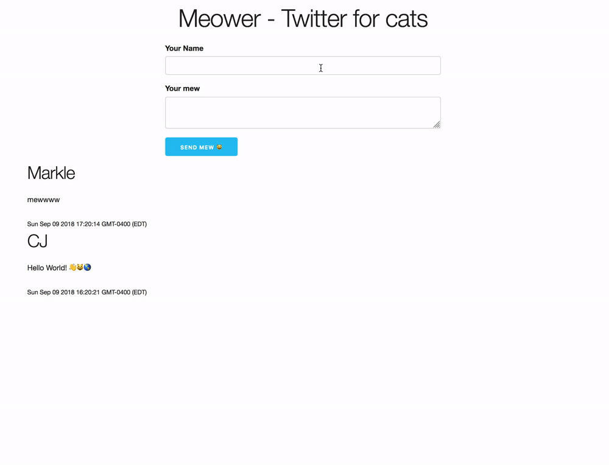

# Meower - Twitter for Cats

A basic twitter clone built to demonstrate the full stack 🥞 (client, server, database).

With the following features:

* Cats can send a mew 😸✉️
* Cats can see all mews that have been sent 😻🗂

## Objectives

* [ ] 📝 Diagram the Full Stack
* [ ] 🔎 Differentiate between Client and Server
* [ ] ⌨️ Get user input on the Client
* [ ] ➡️ Send user input from the client with fetch to the server
* [ ] 🗃 Store data in a database
* [ ] 🔍 Retrieve data from a database on the Server
* [ ] ⬅️ Retrieve data from a server on the client using Fetch
* [ ] 🙈 Hide/Show elements on the client
* [ ] ✨ Add elements to the page on the client
* [ ] 🚀 Deploy the client with now.sh
* [ ] 🚀 Deploy the database with mlab
* [ ] 🚀 Deploy the server with now.sh

## Front-end

* [x] Create client folder
* [x] Setup index.html
* [x] Bring in Skeleton CSS
  * http://getskeleton.com/
  * https://cdnjs.cloudflare.com/ajax/libs/skeleton/2.0.4/skeleton.min.css
* [x] Create Header
* [x] Create form
  * [x] Name
  * [x] Content
  * [x] u-full-width to both inputs
* [x] Listen for form submit
* [x] Hide the form
* [x] Show loading spinner
* [x] Get data from form and log it
* ✅ Get user input on the Client
* ✅ Hide/Show elements on the client

## Back-end

* [x] Create server folder
* [x] npm init -y
* [x] npm install express morgan
* [x] Setup index.js
* [x] Add GET / route
* [x] Add POST /mews route
  * [x] log out req.body

## Front-end

* [x] fetch POST /mews with form data
* [x] See the CORS error and revel in this moment
* ✅ Send user input from the client with fetch to the server

## Back-end

* [x] npm install cors
* [x] Make sure the server is recieving the data
* [x] Add JSON body parser middleware
* [x] Validate name and content
  * [x] Must be a string
  * [x] Cannot be empty
* [x] If not valid
  * [x] Error code 422
  * [x] Invalid mew, must contain name and content
* [x] Setup DB Connection
  * [x] npm install monk
  * [x] connect to db
  * [x] create document collection (mews)
* [x] If Valid
  * [x] Create mew object with
    * [x] name, content, created_date
  * [x] Insert into DB
  * [x] Respond with created mew object
* ✅ Store data in a database

## Front-end

* [x] Log out created Mew after POST request
* [x] Show the form
* [x] Hide loading spinner

## Back-end

* [x] GET /mews
  * [x] Respond with mews from DB
* ✅ Retrieve data from a database on the Server

## Front-end

* [x] fetch GET /mews
  * [x] Iterate over array
  * [x] Append each to page
  * [x] Reverse before appending
  * [x] Show the form
  * [x] Hide loading spinner
* [ ] fetch GET /mews after creating a mew
* ✅ Retrieve data from a server on the client using Fetch
* ✅ Hide/Show elements on the client
* ✅ Add elements to the page on the client

## Back-end

* [ ] npm install bad-words
  * [ ] Use filter before inserting into DB
* [ ] npm install express-rate-limit
  * [ ] Limit to 1 request every 15 seconds

## Deploy

* ✅ Deploy server with now
  * [x] Setup environment variables
    * [x] Database connection
      * process.env.MONGO_URI
  * ✅ Show mlab
  * [ ] Deploy with environment variable
    * now -e MONGO_URI=@meower-db
  * [ ] Add alias
* ✅ Deploy client folder with now
  * [ ] Set API_URL based on hostname

## What's next?

* Add comments/replies to a mew
* User Accounts
  * Don't just have the user enter their name
  * Sign up/Login
* User Profiles
  - Only show mews from a given user
* Search Mews
* Hashtags
* User @mentions
* Realtime feed of mews
